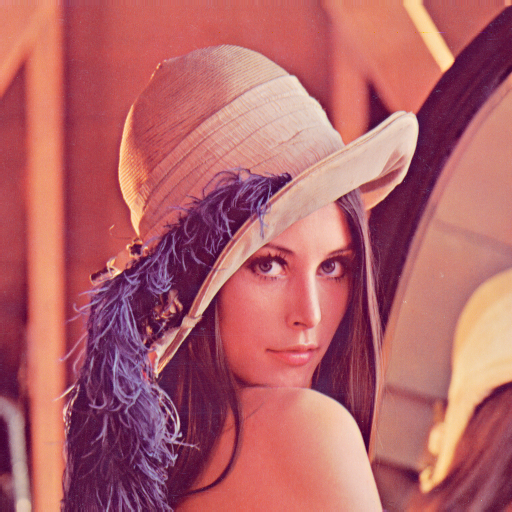
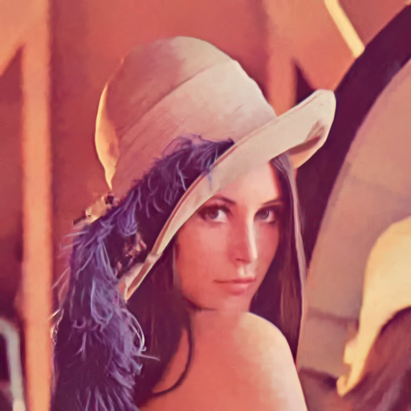

# Usage
If you are using Visual Studio, please modify the property below for a multi-threads support.

> Properties -> C/C++ -> Language -> OpenMP support -> Yes

If you are using g++, just execute the command below.

> g++ -O3 -fopenmp *.cpp

I haven't given a command-line options implementation yet, so you need to modify the `main.cpp` yourself, quite an easy job. The `main.cpp` has provided an example.


# Introduction

Update: The progam has supported the Step2, i.e. Wiener filtering now, both for YUV 4:4:4 or grayscale input.

A simplified C++ implementation of the famous image denoising method [BM3D](https://www.cs.tut.fi/~foi/GCF-BM3D/), with both Step1 (hard-thresholding filtering) and Step2 (Wiener filtering). The project is primally a reference for hardware design, which may not be optimized for software running, but acts more like a hardware pipline. For example, the program processes just a few rows of the image once a time, and the intermediate results are stored in so called lines buffers, which demands much smaller size of memory. I have try my best to make it easier to understand and extend but with an acceptable running speed. Generally, it takes about `4s` for a `512x512` color image and `2.8s` for the grayscale one for Step1 or Step2 (they take almost the same time) on my Intel i5-4590 3.30GHz CPU with OpenMP support. The project has both a float-point and an integer version, which are almost the same that you just need to configure the macro definition in the `global_define.h`. The implementation details mainly refer to the papers below, including the parameters choices, transform types and thresholds, and so on.

> [1] Dabov, Kostadin & Foi, Alessandro & Katkovnik, Vladimir & Egiazarian, Karen. (2007). [Image Denoising by Sparse 3-D Transform-Domain Collaborative Filtering](https://www.researchgate.net/publication/6151802_Image_Denoising_by_Sparse_3-D_Transform-Domain_Collaborative_Filtering). IEEE transactions on image processing : a publication of the IEEE Signal Processing Society. 16. 2080-95. 10.1109/TIP.2007.901238. 

>  [2] Lebrun, Marc. (2012). [An Analysis and Implementation of the BM3D Image Denoising Method](https://www.ipol.im/pub/art/2012/l-bm3d/). Image Processing On Line. 2. 175-213. 10.5201/ipol.2012.l-bm3d. 

Note that, for simplicity without any external libraries, the program uses the YUV format as the image input, and only the `YUV 4:0:0` (i.e. grayscale) and the `YUV 4:4:4` (planar) are supported, usually with `uint8_t` data-type. However, you can easily make a support for RGB image and even video input with the OpenCV library, all you need is just to modify the `main.cpp`. To trasnform an image to YUV 4:4:4 format, you can execute the Python code bewlow. Acutally, The object also supports a sequence of YUV 4:0:0 or 4:4:4 frames as the input.

```python
import numpy as np
import cv2

def rgb2yuv(rgb_file, yuv_file):
    img = cv2.imread(rgb_file)
    yuv = cv2.cvtColor(img, cv2.COLOR_BGR2YCrCb)
    yuvf = open(yuv_file, 'wb')
    yuv[..., 0].tofile(yuvf)	# Y
    yuv[..., 2].tofile(yuvf)	# U
    yuv[..., 1].tofile(yuvf)	# V
    yuvf.close()
    
def yuv2rgb(yuv_file, rgb_file, w, h):
    yuv = np.fromfile(yuv_file, 'uint8', w*h*3).reshape([3, h, w]).transpose((1, 2, 0))
    bgr = cv2.cvtColor(yuv[..., [0, 2, 1]], cv2.COLOR_YCrCb2BGR)
    cv2.imwrite(rgb_file, bgr)
```
As only the 8x8 2D Bior-1.5 wavelet transform implementation and 8x8 Kaiser window (used for pixel-wise weighting in aggregation step) are provided in this program, the patch size only supports 8x8 at present, but it's easy to extend to other sizes by yourself, both square or rectangular. Note that the Bior-1.5 wavelet transform only support a size power of 2, e.g. 4, 8, 16, etc. But if you want to implement an arbitrary size of 2D transform, 2D DCT is quite a well choice. The code below shows the generation of  the 1D DCT-II kernel, and the corresponding 2D Kaiser window with the same patch size. You can also easily find some fast integer implementations of the DCT transform with butterfly optimization online, such as the HEVC or VVC reference software, but the size only supports a power of 2.

```python
def dct2_kern(N):
    A = np.zeros([N, N])
    for k in range(N):
        A[k, :] = np.cos(np.pi * k * (2 * np.arange(N) + 1) / (2 * N))
    A[0, :] /= np.sqrt(2)
    A *= np.sqrt(2. / N)
    return A
    
def kaiser2D(N, beta=2):
    x = np.linspace(-(N-1)/2., (N-1)/2., N, endpoint=True)
    k = np.i0(1. * beta * np.sqrt(1 - 4. * x**2 / (N-1)**2)) / np.i0(1. * beta)
    k = k.reshape([-1, 1])
    k = k.dot(k.T)
    return k
```

Only the 1D Hadamard transform is provided at present for the transformation of the 3rd dimension of the 3D group, but the length (i.e. the number of similar patches in the 3D group) can be varibale, which is decided by the block-matching process. You can extend the transform types if necessary, too. The table below shows the parameters used in my implementation by default, which may not be optimaized for all denoising cases but have been widely discussed in the reference papers above. Note that the parameters of Step1 and Step2 are almost the same, so I just list one for each below.

| Option  |  Value |  Remark |
| --- | --- | --- |
| 2D patch size | 8x8 | now only support 8x8 |
| patch step size | 3 | configurable |
| searching window size | 33x33 | no need to be a square |
| max 3D group size | 16 | configurable (power of 2) |
| 2D transform | 2D Bior-1.5 | now only support 8x8 |
| 1D transform | 1D Hadamard | relative to the group size |
| hard threshold (step1) | 2.7 * sigma | configurable |
| wiener sigma (step2) | sigma_wie | usually be same as sigma of step1 |
| max mean L2 distance | 2500 | L1 is also ok |

> If you can read Chinese, welcome to my blog [《传统图像降噪算法之BM3D原理详解》](https://blog.csdn.net/qq_33552519/article/details/108632146) to have a better understanding of the BM3D algorithm.

# Example
There is a test case in the subfolder `./test`, the widely used image [Lena.png](https://www.cs.tut.fi/~foi/GCF-BM3D/images/image_Lena512rgb.png) with size of 512x512. The noisy image is generated by adding the AWGN to the ground truth, here we use the `sigma=40`, that is:
```python
import numpy as np
h, w, c = gt.shape
noisy = np.clip(gt + np.random.randn(h, w, c) * sigma, 0, 255)
```
I have convert the RGB images to YUV 4:4:4 files, and the PSNR of noisy image in YUV sapce is 19.49 dB. Note that the sigma of the Y/U/V is not the same as the R/G/B, which is relative to the conversion matrix. For example, if `Y = a*R + b*G + c*B`, we can compute that `sigmaY = sqrt(a*a + b*b + c*c) * sigmaR/G/B`, similarly for the U and V. Here we simply use the same sigma for Y/U/V and have tried out the `sigma=36` for a best PSNR (33.67 dB) in the YUV space for Step1. However, we set `sigma_wie=25` for Step2 to have a smoother result, and a better PSNR (34.16 dB) as well.


<center><p>ground truth</p></center>


<center><p>noisy (YUV PSNR: 19.49)</p></center>


<center><p>denoised Step1 (YUV PSNR: 33.67)</p></center>


<center><p>denoised Step2 (YUV PSNR: 34.16)</p></center>
